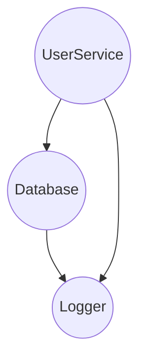
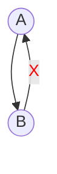

Dipend resolves dependencies using a DAG (Directed Acyclic Graph).
This ensures that dependencies are resolved in the correct order, without cycles, and only when needed.

### What is a DAG

A DAG is a graph with:

- **Nodes**: Your classes or interfaces (dependencies)
- **Edges**: "Depends on" relationships
- **Acyclic**: No circular dependencies allowed

This model guarantees a safe, predictable and efficient resolution order, which is critical for building complex systems.

### Resolution Flow

When you call `getDependency` or `resolveSingletons`, Dipend performs:

- Graph construction for the dependency tree of App.
- Topological sort of the nodes to determine creation order.
- Validation for cycles or missing bindings.
- Instance creation, respecting the lifecycle of each node (singleton or transient).

This ensures your app is wired safely and correctly, every time.

### Example

Consider the following classes:

```typescript
class Logger {}

class Database {
  constructor(private logger: Logger) {}
}

class UserService {
  constructor(private db: Database, private logger: Logger) {}
}
```

Dipend builds a graph like this:



The resolution order will be:

- Logger
- Database (which depends on Logger)
- UserService (which depends on Database and Logger)

No class is constructed before its dependencies are resolved.

### Circular Dependencies

Dipend will detect and prevent circular dependencies.



> 💥 If you create a circular chain, Dipend will throw an Error during resolution.
